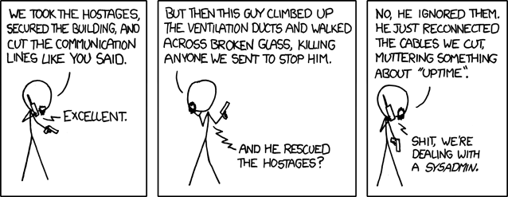

Working on a project with a team is a difficult task. If the project is not simple, you need to build it, test it and publish it and you can have multiple project with similar command but different parameters or path for build/test/stuff-making.
Other times you can have a team of developer and the build/test/stuff-making will be done by THE sysadmin[^1].

[^1]: [Team and Sysadmin]() description from my expirience

From personal expirience if you don't have a method for the build/deploy/test for the project at the first update will came Murphy and make you an unhappy soul or have some colligue with a battle axe asking for a little talk about the build/deploy/test.

For this reason I suggest a template for developing something into a git repo:

* Build script
* Documentation
* Testing
* Lint

## Documentation

Not a full documentation, a basic one for rapid use. You need to have a full documentation of every project you will work and all you worked on sorted and updated at last version. In the git project is better to have a little README.md with the description of the project and one or two faq of the project.

In this way you will have allways have a cookbook for the everyday task.

Some git hosting like GitHub, GitLab and GitTea will show your README.md at the page of the project as HTML so it can be also a "What the f**k is this project" page.

## Building script

Any project you have will be having a different set of config and command to launch every task. 
Sometime you will make one or more script for your task and you need to remember all of the function and launch command. So I write a makefile for all my project, personal and job related.

### Base of makefile

For write a good makefile you only need to write some statement like this


RULE: DEPENDENCY LINE ## COMMENTS
	[tab]ACTION LINE(S)


You can have multiple "rule", one for any task you need, and I suggest one with code and other generic:


.PHONY: help
help: ## Show this help
	@egrep -h '\s##\s' $(MAKEFILE_LIST) | sort | awk 'BEGIN {FS = ":.*?## "}; {printf "\033[36m%-20s\033[0m %s\n", $$1, $$2}'


This magical command[^2] will use all your comment inline with the _rule_for build a help command. __.PHONY__ is a string you put for a __"A phony target is one that is not really the name of a file; rather it is just a name for a recipe to be executed when you make an explicit request"__, it is a string for not having conflicts.
[^2]:Taken from [victoria.dev](https://victoria.dev/blog/how-to-create-a-self-documenting-makefile/)

Other _rule_I use are:

* __install__: setup the env for the project
* __docs__: build the docs of the project if there are inside the project
* __run__: run the env for the project
* __test__: launch the test for the project

This is a example of one of my project. You can see at the __RUN__  _rule_ you can follow the _rule_ with other  _rule_ for run them __before__ the  _rule_ in question.


.PHONY: install
install:  ## Make venv and install requirements
	pipenv install --dev

.PHONY: docs
docs: ## Build the docs
	pipenv run mkdocs build --clean

.PHONY: run
run: install docs ## Run all the task for building


So, every time you will use this _makefile_ with _run_ you will run _install_, _docs_ and _run_ in this sequence.

## Force Testing 

Testing is one of the must of programming. And it can be done only with scripting. 
The best way I found is using the _makefile_. Setting up a good testing suite with a full cover for the code is the base of a good project. 

And a good way for testing is using some type of _Continuous Integration_ like [_GitHub Action_](https://github.com/features/actions), [_Circle CI_](https://circleci.com/) or [_Travis CI_](https://travis-ci.org/).

If you will use a _CI_ with a [git-flow](http://danielkummer.github.io/git-flow-cheatsheet/)'s flow you can make the tests' result blocking for merging branch. 

## Lint and reformatting

Lint or Linter[^3] is an obscure thing. And make the code look readble. So I use a lot of [git hooks](https://git-scm.com/book/en/v2/Customizing-Git-Git-Hooks) or [_pre-commit_](https://pre-commit.com/) for linting or reformatting.
[^3]: Lint is a static code analysis for finding bugs or other bad codes

### Git hooks

You can write a bash/python/perl/what_you_want with all the code you need to lint or reformatting but there are some problems:

* Is not inside the repo so is not versioned
* Is difficult to debug it
* You need to manual set it at the start of the dev, not easy to script for the setup of the project.

### Pre-Commit

Pre commit is a framework for _pre-commit hooks_. It has a lot of hooks ready for lint and reformatting the code and, like the normal git hook, block the commit if the hook change something.

Also the command _pre-commit run_ will run the pre-commit hooks without make a commit. Sometime is usefull

## Conclusion

With this setup you can have a lot of automatic task for your project so you and your team will work better, more like a clock and without a lot of coordination if you can follow a standar template like this. 

And you can leave and enter in any project in an easy and fast way.
